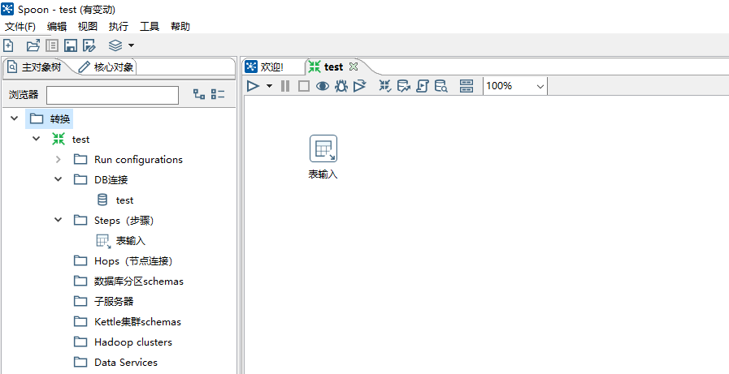
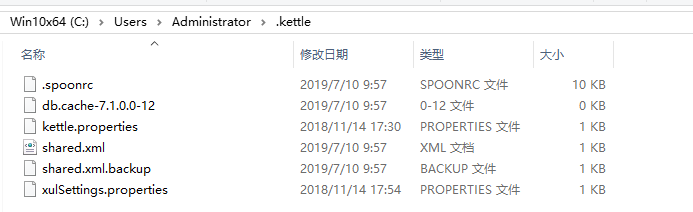

[更多信息https://blue-shadow.top/](https://blue-shadow.top/)

[更多信息在Github上:https://github.com/Shadow-Hunter-X](https://github.com/Shadow-Hunter-X)

##  Kettle主要的功能模块

使用Kettle时，包括了在ETL开发部署中用到的多个程序，每个程序都有独立的功能：

|程序名|功能说明|
|-----|-----|
|spoop|图形界面工具，快速设计和维护复杂的ETL工作流。集成开发环境，提供了一个图形用户界面，用于创建/编辑作业和转换|
|kitchen|运行作业的命令行工具。作业的命令行运行程序，可以通过Shell脚本来使用|
|pan|运行转换的命令行工具，和Kitchen一样通过Shell脚本来使用。执行转换而不是作业|
|carte|轻量级的（大概1MB）Web服务器，用来远程执行转换或作业|

### Spoon 集成开发环境

### 命令启动kitchen和pan

作业和转换可以在图形界面里执行，但这是在开发，测试和调试阶段。在开发完成之后，需要部署到实际的环境中，在部署阶段很少用到Spoon。
部署阶段一般用命令行执行，需要把命令放入到shell脚本中，并定时调用这个脚本，kitchen和pan就是用于这个阶段，用于实际生产环境。

kitchen用于执行作业；pan用于执行转换。

### 作业服务器 carte

carte服务用于执行一个作业，就像kitchen一样，但是和kitchen不同的是，carte是一个服务，一致在后台运行 ，而kitchen只是运行一个作业就退出。

## 其他模块

* encr.bat 和 encr.sh
这个工具用于加密密码，在使用kettle时，会有很多场景下需要输入密码

## kettle的配置
kettle运行环境中有几个文件影响kettle的运行环境，这些文件可以视为kettle配置文件，当kettle做了环境移植或升级时，这些文件也要随之改变。
这些配置之文件，主要放在对应账号家目录下的.kettle文件夹中。

涉及的文件如下所示：
.spoonrc ； jdbc.properties ; kettle.properties ; kettle.pwd ; repositories.xml ; shared.xml

* .spoonrc     
    .spoonrc 文件用来存储Spoon程序的运行参数和状态，其他的Kettle程序不适用这个文件

* jdbc.properties    
    在kettle的装目录下的simple-jndi文件夹下，这个文件用来保存存储JNDI连接对象参数。kettle可以用JNDI的方式引用JDBC连接参数。
    对于jdbc.properites文本内容的配置信息如下：

    * type : 永远是 javax.sql.DataSource
    * driver : JDBC Driver驱动器的全名称
    * url  : 用于连接数据库的JDBC URL连接串
    * user : 数据库用户名
    * password : 数据库密码

* kettle.properties   
    一个通用的保存kettle属性的文件

* kettle.pwd
    使用Carte服务执行作业需要授权，授权可以是特定的方法，授权方式将密码保存在kettle.pwd文件中，kettle.pwd文件位于kettle安装目录下
    的pwd文件夹下，默认情况下kettle.pwd的内容如下：

~~~
# This file was generated by Pentaho Data Integration version 7.1.0.0-12.
# 
# Here are a few examples of variables to set: 
#
# PRODUCTION_SERVER = hercules
# TEST_SERVER = zeus
# DEVELOPMENT_SERVER = thor
#
# Note: lines like these with a # in front of it are comments
#
~~~

* repositories.xml     
    kettle可以通过资源管理转换，作业和数据库连接这样的资源。如果不适用资源库，也可以用文件进行替换，每一个转换和作业都保存各自的数据库连接参数。

    为了使操作资源库更容易，在repositories.xml文件中保存了所有的资源库，repositories.xml可位于两个目录下：
    .kettle目录下或carte工具的路径下。

* shared.xml 
    管理kettle中的共享对象。共享对象就是类似于转换步骤，数据库连接定义，集群服务器定义等这些可以一次定义，然后在转换或作业
    里进行多次引用的对象。

## 管理JDBC驱动器

    连接各不同的数据库，使用不同的JDBC驱动器，一般驱动器就是一个jar文件，在kettle中将所有的JDBC驱动保存在libext/JDBC中
    要添加新的驱动器,只需将相应的jar文件放到libext/jdbc目录下即可
