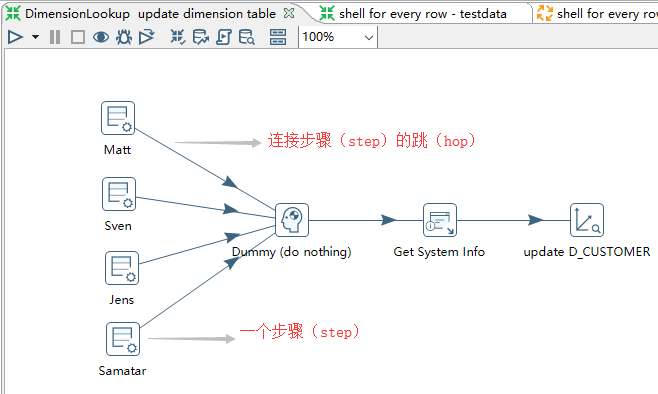
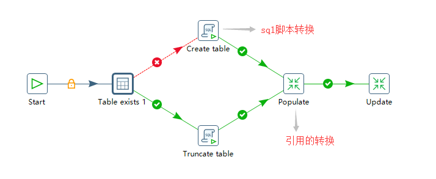
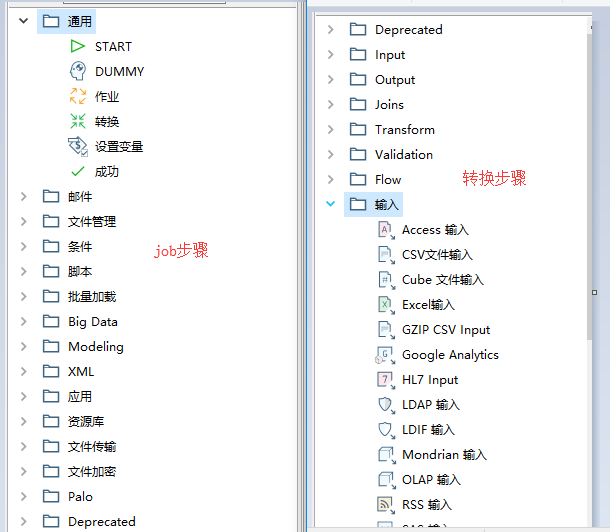
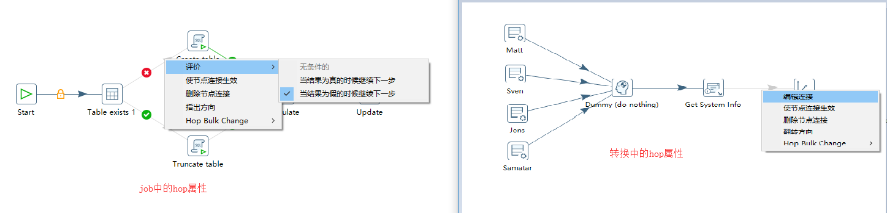
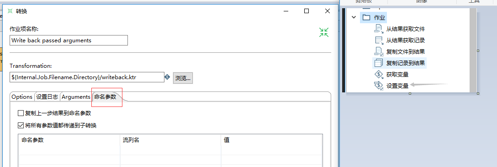
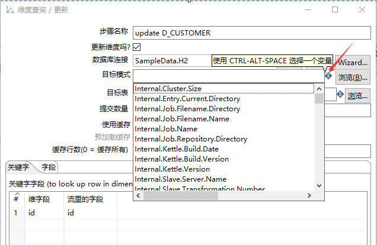

[更多信息https://blue-shadow.top/](https://blue-shadow.top/)

[更多信息在Github上:https://github.com/Shadow-Hunter-X](https://github.com/Shadow-Hunter-X)

## kettle基本概念

### 转换-transformation       
    用来处理抽取，转换，加载各阶段各种对数据的操作。转换中包括一个或多个步骤-step,各个步骤间通过hop来连接,如下图所示：

### 作业-job
    相对比转换，更高层级的数据流控制。一个作业包括一个或多个作业项，这些作业项以一定的顺序执行。作业项由hop连接。如下图所示：

>>>二者的区别，在pentaho wiki上的说明为
[pentaho wiki FAQ : https://wiki.pentaho.com/display/EAI/Beginners+FAQ](https://wiki.pentaho.com/display/EAI/Beginners+FAQ)

Transformations are about moving and transforming rows from source to target. Jobs are more about high level flow control: executing transformations, sending mails on failure, transferring files via FTP, ...
Another key difference is that all the steps in a transformation execute in parallel, but the steps in a job execute in order 

转换是对数据进行清洗转移，从数据源传输到数据数据目标 ; 而作业这是更高层级的数据流，如执行转换,失败是发送邮件，通过FTP传输文件等。
对于二者的一个显著的差异是：在转换中各步骤是同步并行的，而在作业中各步骤是顺序执行的

### 步骤-step
    在kettle中基本的ETL单元，可以为转换步骤或作业步骤。 每个步骤是具有特殊逻辑功能的一个单元体。对于是同类功能的步骤，在kettle又在
    逻辑上划分到同一个文件夹下。

### 跳-hop
    连接步骤间的执行先后顺序，形成数据流动的方式，并且能够根据上游的数据执行，在作业步骤间可以进行选择数据的流向（即进行条件选择）。

### 参数和变量

    数据整合工具对参数的支持也是非常重要的，参数可以使工作变得更加可维护。

-   定义变量
    每个变量都又一个唯一的名字，变量可以是系统级变量也可以是在作业动态设置的。对于系统变量包括Java虚拟机的变量和Kettle内部定义的变量。
    对于自定义变量的，最常用的方式间变量保存到kettle.properies中。也可以在作业执行的时候动态设置变量，通过转换进行设置，使用“set variables”步骤，对于更灵活的情况下，可以使用“JavaScript”或“user defined java class” 步骤。

-   命名参数
    对于有一些变量应该作为转换或作业的参数更好，可以在设置对话框的“命名参数”标签页面下设置这些参数

-   对于变量和参数的使用方法        
    引用变量使用 **${}** 符号,在所有的能使用变量的输入框，都有一个菱形美元符号的表及位于文本框的右方。

